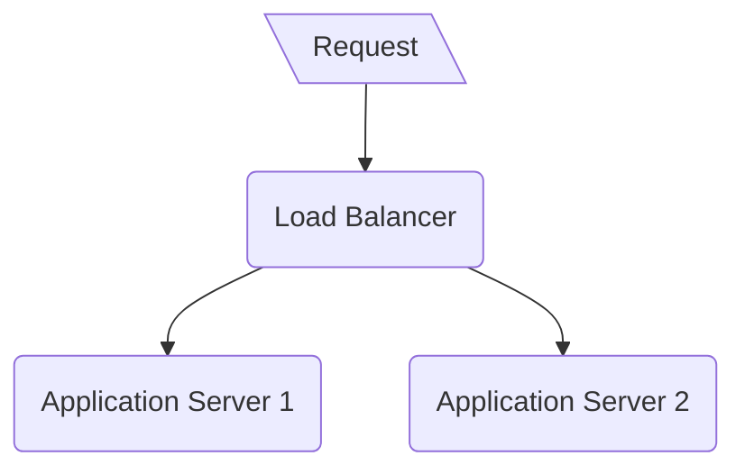

# Load balancing exercises

This is a playground for playing with load balancers.



## How to start

## I have Docker

Build and run all containers

```bash
docker-compose build && docker-compose up
```

Sometimes you may need to remove containers in order to reload them and apply changes:

```bash
docker-compose down && docker-compose build && docker-compose up
```

If the containers are up and running, you may run the benchmark:

```bash
curl -X GET --location "http://localhost:8082/benchmark"
```

## I don't have Docker

Start the apps in separate terminals/processes:
```bash
cd app/java && SERVER_PORT=5001 ./gradlew bootRun
```

```bash
cd app/java && SERVER_PORT=5002 ./gradlew bootRun
```

Start the load balancer:
```bash
cd loadbalancer/java && SERVER_PORT=8081 ./gradlew bootRun
```

Try out some requests and see, whether they get to the apps:
```bash
curl -X GET --location "http://localhost:8081/status"
```

## Tasks

### 1

Implement the chosen loadbalancer (python or java) in order to spread the traffic evenly between two app servers.
It should use the round-robin algorithm.

### 2

Load balancer should have an endpoint for registration of the new application server.

1. Implement the endpoint in load balancer:

```http request
POST http://localhost:8081/instances

{
  "url": "localhost:5003"
}
```

2. Start a new instance in a separate terminal/process:

```bash
cd app/java && SERVER_PORT=5003 ./gradlew bootRun
```

3. Register the new instance in load balancer and test whether it receives the traffic.

### 3

Load balancer cannot route the traffic to unhealthy servers.
Implement checking liveness of every instance by the load balancer every 100ms.
Unhealthy instances must not receive requests from the load balancer.
