# Konspekt do zajęć

### Ankieta
Daj nam feedback i pomóż nam ulepszyć zajęcia, uzupełniając tę ankietę: https://forms.gle/y8opbHf7rNFZVfRx6

## Agenda
1. Wprowadzenie do load balancingu
2. Load balancing DNS
3. [Zadanie] DNS resolving
4. Load balancing jako urządzenie fizyczne
5. [Zadanie] Load Balancer HTTP
6. Load balancing na różnych warstwach ISO/OSI
7. [Zadanie] Load balancer warstwy 4

## Wiedza

### Dlaczego potrzebujemy load balancera?

#### Sytuacja

Nasza aplikacja staje się popularna. Serwer dostaje coraz więcej ruchu i zużycie procesora rośnie.
Analitycy przewidują, że liczba użytkowników naszej aplikacji podwoi się w najbliższym czasie.
Musimy wdrożyć nową wersję aplikacji, w której dodajemy krytyczną funkcjonalność.
Inwestorzy naciskają, aby nie było żadnych przerw technicznych w działaniu aplikacji.

#### Komplikacja

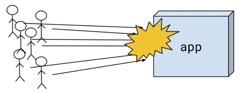

Gdy liczba użytkowników wzrośnie, nie będziemy w stanie obsłużyć ruchu na serwerze.
Wdrożenie spowoduje przerwę techniczną.

#### Rozwiązanie 

Użycie load balancera.

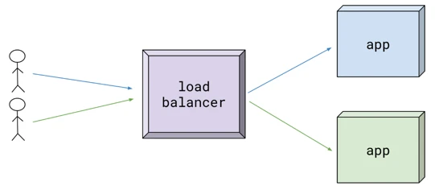

Pozwoli nam on wyskalować aplikację horyzontalnie (czyli zwiększając ilość serwerów zamiast wymiany serwera na mocniejszy).
Umożliwi nam wdrożenie typu blue-green (znane również jako zero-downtime deployment).

### Założenia load balancingu

#### Skalowalność (ang. Scalability)

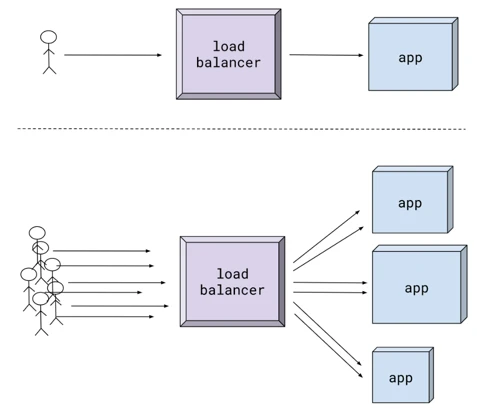

Zdolność dynamicznego przystosowywania się systemu do zwiększonego ruchu bez wpływu na wydajność. Gdy mówimy o load balancingu mamy na myśli zazwyczaj skalowalności horyzontalną, która polega na dodawaniu nowych maszyn/serwerów do klastra obsługującego ruch. Z perspektywy użytkownika proces skalowania powinien być niewidoczny - cały klaster powinien być traktowany jako jeden wirtualny serwer.

#### Wysoka dostępność (ang. High availability)

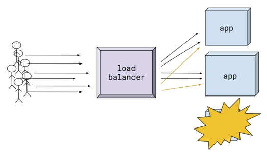

O wysokiej dostępności możemy mówić, gdy obsługujemy ruch poprawnie nawet gdy część systemu ulega awarii. Przykładowo, gdy jeden z serwerów ulegnie uszkodzeniu ruch powinien być przekierowany natychmiast do pozostałych.

#### Przewidywalność (ang. Predictability)

Posiadamy kontrolę nad tym jak i kiedy obsłużymy ruch. Oznacza to, że mamy całkowity wpływ na to do którego serwera zostanie przekierowany użytkownik w momencie zapytania.

### Load balancing z użyciem DNS

Pierwszym rozwiązaniem używanym do podstawowego load balancingu było użycie protokołu DNS. Pozwala on na zwracanie listy adresów gdy pytamy o domenę. Gdy dostajemy taką listę, zazwyczaj wykorzystuje się pierwszy adres do połączenia. DNS zwracając listę adresów w odpowiedzi na kolejne zapytanie wykorzystuje algorytm round-robin. Pierwszy adres z listy zwracany jest na ostatniej pozycji. Dzięki temu kolejna osoba, która odpytuje się DNS, prawdopodobnie wykorzysta inny serwer.

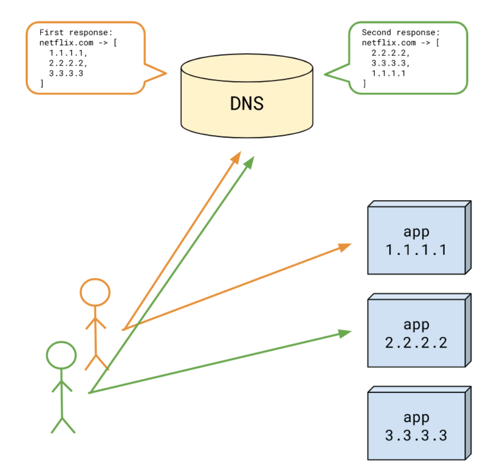

Z tą technologią wiąże się kilka ograniczeń. Pierwsze jest związane z maksymalną długością odpowiedzi jaką może zwrócić serwer DNS. Największa gwarantowana odpowiedź [wynosi 512 bajtów](https://labs.apnic.net/index.php/2020/10/31/dns-xl/#:~:text=The%20DNS%20operates%20in%20a,DNS%20response%20was%20512%20octets) (niektórzy klienci obsługują większe, ale nie wszyscy). W Allegro istnieją usługi uruchomione na raz na kilkuset serwerach - to za dużo, aby pomieścić je w dozwolonej odpowiedzi DNS. Ta wada ogranicza nam znacznie skalowalność. Drugą istotną rzeczą jest dostępność. Jeśli jeden z serwerów z listy przestanie działać nie jesteśmy w stanie szybko go z niej wykluczyć.

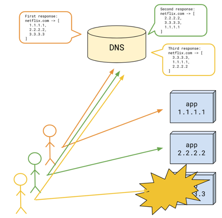

Serwowanie listy adresów nie jest jedynym rozwiązaniem. Posiadając własny serwer DNS (zwany nameserver, NS lub Authoritative DNS) możemy serwować za każdym razem inny adres IP. Możemy dzięki temu przekierować użytkownika do konkretnego serwera, oraz przed udostępnieniem adresu upewnić się, że serwer zlokalizowany pod nim działa poprawnie. Tutaj niestety przeszkodzi nam mechanizm cache’owania odpowiedzi DNS. Zarówno przeglądarka, system operacyjny oraz wszystkie serwery DNS po drodze mogą na jakiś czas zapamiętać serwowany adres. Przez to nie mamy całkowitej kontroli nad tym do jakiego serwera trafi użytkownik i czy będzie on dostępny.

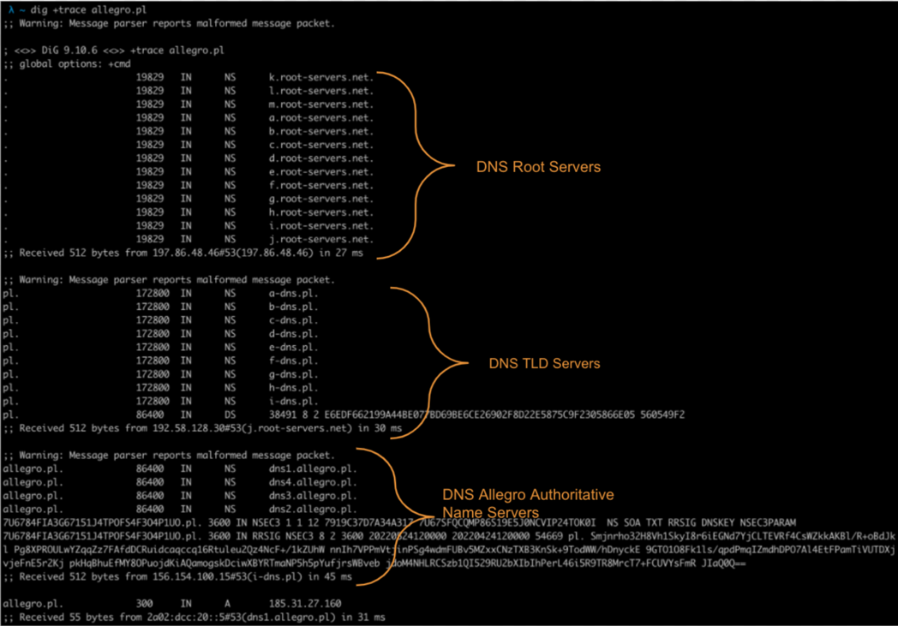

Wykorzystująć alorytmy DNS doświadczymy również problemu z utrzymaniem przewidywalności. Przez algorytm round robin nie jesteśmy w stanie kontrolować jaka ilość ruchu trafia do konkretnego serwera. Dodatkowo mechanizmy cache’owania mogą sprawić, że ruch ten będzie nierównomierny. To sprawia, że będziemy mieli problemy z przeciążonymi serwerami (w momencie, gdy serwer jest maksymalnie obciążony nadal będą do niego kierowane kolejne zapytania) lub zasoby będą nieefektywnie wykorzystane (zawsze będziemy musieli mieć zapas mocy obliczeniowej na każdym z serwerów).

### [Zadanie] DNS

Celem zadania jest dowiedzieć się czy dana usługa korzysta z loadbalacingu za pomocą protokołu DNS. Użyjemy do tego komendy dig lub strony https://www.nslookup.io/

Wykonajmy proste zapytanie o domenę google.com.

W odpowiedzi zwróćmy uwagę na:
- Zwrócony adres IP serwera google (216.58.209.14).
- TTL, czyli czas, przez jaki jeszcze ten adres będzie ważny (przez tyle sekund możemy go zapamiętać i nie pytać o niego).
- Serwer DNS, który zwrócił nam odpowiedź. W tym przypadku jest to adres sieci lokalnej (172.20.\*.\*), a więc zwrócony wpis był zapamiętany/zacacheowany przez lokalny DNS resolver

Możemy zapytać o rekordy typu NS-czyli o to, jakie serwery odpowiadają za propagowanie domeny google.com.

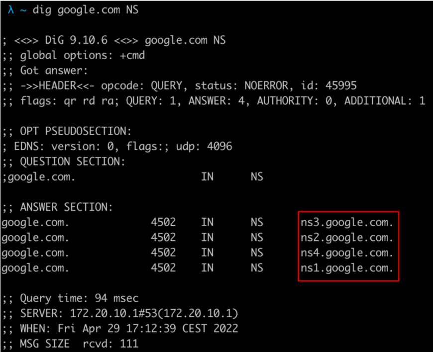

Dostaliśmy adresy czterech serwerów, które są źródłem prawdy na temat tego, gdzie znajduje się google.com. Zapytajmy się bezpośrednio jednego z tych serwerów o wpis.

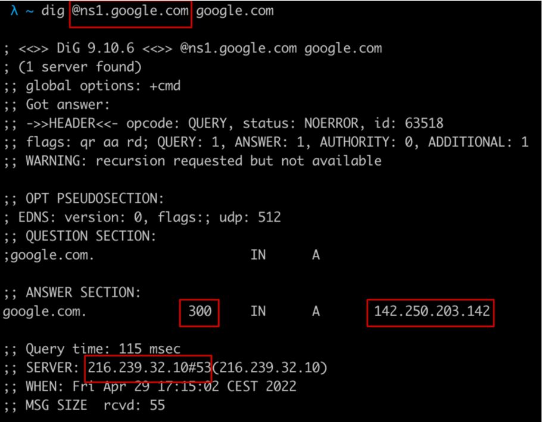

Dostaliśmy adres z TTL równym 300 sekund-czyli 5 minut. Przez tyle ten adres może być zapamiętany. Po tym czasie pośrednie serwery DNS muszą się ponownie odpytać jednego z serwerów NS o adres. Zauważ, że podczas pierwszego zapytania dostaliśmy TTL równy 196. To oznacza, że ten adres będzie zapamiętany na lokalnym DNS jeszcze przez 196 sekund (czyli był prawdopodobnie pobrany z serwera NS 104 sekundy wcześniej).

Zapytanie możemy powtórzyć kilka razy aby sprawdzić, czy za każdym razem dostaniemy ten sam adres. Użyję parametru +short dla czytelności (wypisany zostanie sam adres IP).

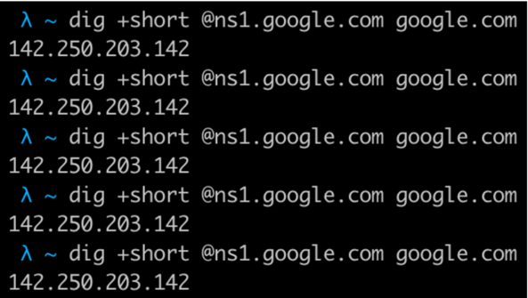

W tym przypadku adres jest jeden, a więc nie możemy potwierdzić, że serwis google.com korzysta z loadbalancingu za pomocą DNS.

**Twoim zadaniem jest wykonanie podobnego testu dla serwisów allegro.pl oraz netflix.com**

Jakie są rekordy NS dla danego serwisu?
Jaki jest maksymalny TTL dla wpisu z adresem IP?
Czy serwis wykorzystuje loadbalancing DNS?

**[Dodatkowy materiał]** Jak działa DNS możesz dowiedzieć się w tym komiksie: https://howdns.works/

### Load balancer jako urządzenie fizyczne

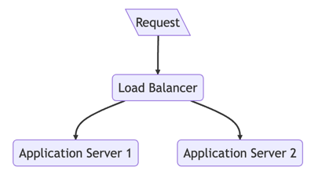

Wykorzystanie fizycznego load balancera pozwala nam całkowicie zwirtualizować nasz serwis dla użytkownika. Nie łączy się on już z konkretną instancją naszej usługi, ale z load balancerem. Zapytanie jest dalej przekazywane do instancji wybranej przez load balancer. Cały proces jest w pełni kontrolowany przez load balancer (wybiera on na jaki konkretny serwer trafi zapytanie). Mając takie rozwiązanie możemy mówić już nie tylko o balansowaniu ruchu (load balancing), ale o jego dystrybucji (load distribution). Load balancer będąc świadomy jakie serwery znajdują się w klastrze może skierować więcej ruchu do tych o większej mocy obliczeniowej i mniej do tych z mniejszą mocą.

#### Load balancing HTTP

Popularnym modelem działania Load balancera jest load balancing ruchu HTTP. W tym przypadku do load balancera trafia całe zapytanie. Load balancer ma dostęp do metody, ścieżki, nagłówków oraz zawartości zapytania http, jak również zwracanej odpowiedzi. Na podstawie parametrów zapytania mogą podjąć decyzję do jakiego serwera skierować dane zapytanie.

##### Mikroserwisy i load balancing po stronie klienta

W architekturze mikroserwisowej, gdy robimy zapytanie do innego serwisu (który ma wiele instancji), możemy zaimplementować load balancing po stronie klienta HTTP. Istnieją do tego gotowe rozwiązania (na przykład Spring Cloud LoadBalancer: https://spring.io/guides/gs/spring-cloud-loadbalancer/). Aby zastosować to rozwiązanie potrzebujemy znać również adresy instancji serwisu z którym chcemy się połączyć - ten problem możemy rozwiązać za pomocą Service Discovery.

### Algorytmy wykorzystywane do load balancingu

#### Statyczne

##### Round robin

Prosty algorytm polegający na przekazywaniu każdego kolejnego zapytania do następnego serwera z listy.

##### Weighted round robin

Modyfikacja round robin polegająca na przekazywaniu do każdego serwera ilości zapytań proporcjonalnej do jego wagi.

##### IP hash

Wylicza hash z adresu IP i na jego podstawie wybiera odpowiedni serwer. Gdy serwery obsługujące ruch się nie zmieniają to algorytm ten gwarantuje obsługę zapytań od ego samego użytkownika przez ten sam serwer.

#### Dynamiczne

##### Least connection

Wybieramy serwer, który ma najmniej otwartych połączeń.
Weighted least connection
Jak wyżej, ale zakładamy, że niektóre serwery są w stanie obsłużyć więcej połączeń niż inne. Dlatego przypisujemy im wagi.

##### Weighted response time

Na podstawie ilości otwartych połączeń i średniego czasu odpowiedzi wybieramy serwer, który potencjalnie najszybciej obsłuży zapytanie użytkownika.

##### Resource based

Wymaga monitorowania zasobów dostępnych w danej chwili na serwerze (zużycie CPU i pamięci). Na tej podstawie wybieramy najmniej obciążony serwer.

#### Sticky Session

Kiedy chcemy, aby sesja danego użytkownika była przekierowana zawsze do tego samego serwera możemy skorzystać z tak zwanego “sticky session”. Jest on możliwy do zaimplementowania w Load balancerach HTTP, ponieważ za każdym zapytaniem odczytujemy nagłówki zapytania - możemy dzięki temu dodawać ciasteczka (cookies) za pomocą których oznaczymy sesję użytkownika.

### [Zadanie] Load balancing HTTP
Ściągnij na swój komputer repozytorium https://github.com/mkuzmik/load-balancing-exercises

Repozytorium oraz zadania są opisane w pliku README.md

### Warstwy sieciowe, a loadbalancing

Implementując loadbalancer istotne jest, aby zdecydować na jakiej warstwie sieciowej powinien on działać. Rozróżniamy dwa typy load balancerów w zależności od tego w jakim modelu sieciowym działają.

#### Warstwa 4 - transportowa.

Gdy loadbalancer dostaje pakiet warstwy 4 ma do dyspozycji trzy wartości:
- Adres i port źródłowy
- Adres i port docelowy
- Zawartość pakietu (zazwyczaj zaszyfrowana)

Load balancer używa procesu NAT (Network Address Translation) do wykonania dwóch operacji:
- Gdy przychodzi zapytanie to podmienia Adres i port docelowy na dane konkretnej instancji serwera
- Gdy odbiera odpowiedź to podmienia Adres i port źródłowy na swój własny

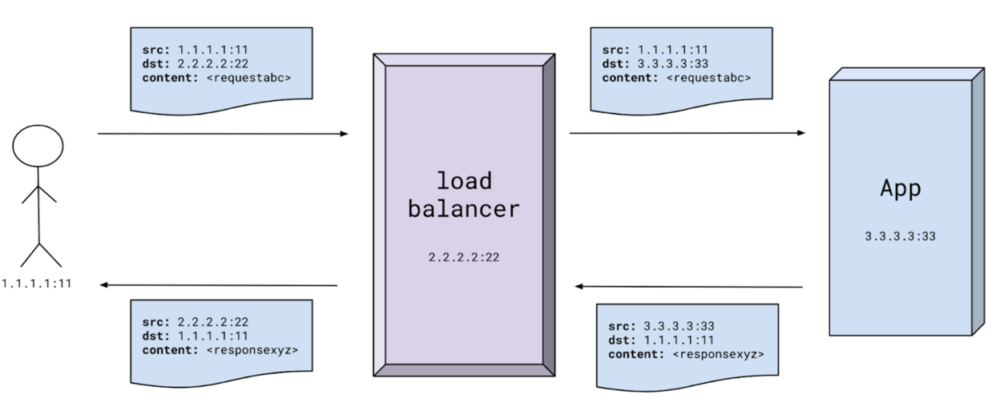

W takim modelu load balancer nie jest świadomy, jaka jest zawartość pakietu, którą przekazuje (może ją odczytać, ale może być ona zaszyfrowana).

#### Warstwa 7 - aplikacji.

Przykładem load balancera działającego na warstwie 7 jest Load balancer HTTP. Load balancer działając na warstwie 7 ma możliwość odczytania zawartości, którą przekazuje. Na podstawie parametrów zapytania może on podjąć decyzję do którego serwera przekaże dane zapytanie. W porównaniu do load balancerów działających na warstwie 4, potrzebuje on więcej mocy obliczeniowej (rozszyfrowanie oraz odczytanie zapytania, zaszyfrowanie i odczytanie odpowiedzi, podjęcie bardziej złożonej decyzji). Jest jednak w stanie efektywniej zarządzać ruchem, ponieważ na więcej dostępnych danych na podstawie których rozdziela ruch.

### [Zadanie] Load balancing TCP

Ustawić nginx jako loadbalancer TCP: https://docs.nginx.com/nginx/admin-guide/load-balancer/tcp-udp-load-balancer/

Porównać wydajność z loadbalancerami HTTP. Możesz w prostej wersji postawić dwa nginxy - jeden HTTP, jeden TCP i puścić benchmark kilka razy :)

## Źródła

https://www.f5.com/content/dam/f5/corp/global/pdf/white-papers/evolution-adc-wp.pdf

https://www.cloudzero.com/blog/horizontal-vs-vertical-scaling

https://www.nginx.com/resources/glossary/dns-load-balancing/

https://en.wikipedia.org/wiki/Round-robin_DNS

https://labs.apnic.net/?p=1380#:~:text=The%20DNS%20operates%20in%20a,DNS%20response%20was%20512%20octets.

https://www.nginx.com/resources/glossary/load-balancing/

https://howdns.works/

https://www.cloudflare.com/en-gb/learning/performance/types-of-load-balancing-algorithms/

https://docs.aws.amazon.com/elasticloadbalancing/latest/application/sticky-sessions.html

[Rysunki](https://docs.google.com/drawings/d/1568iBg6zM_DI0wiP2_A7jg_Ppg8-wdwCWUzTER9dYK0/edit)

